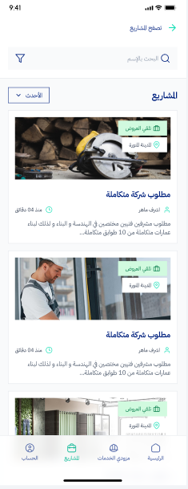

# Ammed (عمد) - Construction & Service Management Platform

## 🌟 Overview
**Ammed (عمد)** is a high-performance platform designed to streamline construction project management. It bridges the gap between clients and contractors with a focus on reliability, scalability, and modern architecture.

## 📱 App Preview

  
  
  
  

---

## 👨‍💻 Developed By
### **Eslam Saleh**
**Senior Flutter & Full-Stack Developer**

Expert in developing high-end mobile solutions with a focus on Clean Architecture and performance optimization.

- **Portfolio**: [Visit Live Portfolio](https://eslamsaleeh98.github.io/Ammed/)
- **GitHub**: [@eslamsaleeh98](https://github.com/eslamsaleeh98)

---

## 🛠 Technical Implementation (Programmatic Features)

### 🏗 Architecture & State Management
- **Clean Architecture**: Implemented a scalable multi-layer architecture (Data, Domain, Presentation) to ensure maintainability.
- **Bloc/Cubit Pattern**: Robust state management for complex UI flows and real-time data updates.
- **Dependency Injection**: Used `GetIt` for efficient service management.

### ⚙️ Core Technical Features
- **Dynamic Bidding System**: Programmed a real-time logic for contractors to submit bids with automatic validation and status tracking.
- **Advanced Networking**: Built a custom API client using `Dio` with interceptors for token management and error handling.
- **File Management**: Programmed a multipart upload system for large engineering documents and site images.
- **Real-time Interactions**: Integrated Firebase Cloud Messaging (FCM) for instant project updates and chat notifications.
- **Complex UI Components**: Developed custom reusable widgets and complex animations for a premium user experience.

### 🔒 Security & Performance
- **Secure Storage**: Implemented `flutter_secure_storage` for sensitive user tokens and credentials.
- **Optimization**: Lazy loading of project lists and image caching to ensure smooth performance on low-end devices.

---

## 🚀 How to Run locally
1. Clone the repository.
2. Run `flutter pub get`.
3. Launch on emulator or physical device.

### 🌐 Live Showcase

